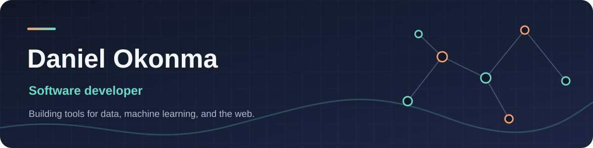

I build tools that make data easier to explore, explain, and act on. My work spans fraud detection, machine learning, and interactive web apps. I like taking an idea from a rough script to something people can actually use.

### Selected projects

| Project | What I built |
| ---- | --- |
| [Neural Network Playground](https://github.com/okonma01/neural-network-playground) | Train a small neural network in your browser to learn the shape of an SVG. I wrote the training engine in plain JavaScript, with adjustable activations and hyperparameters. Try it [here](https://okonma01.github.io/neural-network-playground/)! |
| [Everything is a Tensor](https://github.com/okonma01/tensor-visualizer) | A visual explainer for how tables, sequences, text, and images become PyTorch tensors. Built with React, Vite, and Tailwind CSS. Try it [here](https://okonma01.github.io/tensor-visualizer/)! |
| [Network Graph](https://github.com/okonma01/network-graph) | Generate and transform transaction data into a network of accounts, transfers, emails, and phone numbers for fraud analysis. Python, NetworkX, and Tableau. Try it [here](https://network-graph.streamlit.app/)! |
| [Make or Miss](https://github.com/okonma01/mom-frontend) | A basketball simulation with an interactive React presentation of the game, play by play, and postgame stats. Play it [here](https://mom-frontend.fly.dev/)! |
| [PCA Basketball Analysis](https://github.com/okonma01/nba-pca) | Analyze NBA play styles using PCA and clustering techniques. Read the notebook [here](https://colab.research.google.com/github/okonma01/nba-pca/blob/main/notebook.ipynb). |

### What I work with

**Code:** Python, JavaScript, SQL, Java, C  
**ML and data:** PyTorch, scikit-learn, pandas, NumPy, NetworkX, Tableau  
**Web and cloud:** React, Vite, HTML/CSS, FastAPI, Google Cloud Platform, Docker, Streamlit

At Definity Insurance, I built fraud intelligence workflows, data pipelines, and ML prototypes, including document tampering detection and tools for investigating linked entities.

I'm now studying for an M.S. in Data Science at the CUNY Graduate Center, where I will deepen my knowledge of machine learning, data visualization, and artificial intelligence, and explore new applications of these technologies.

Outside work, I experiment with local language models, music tools, and interactive ways to explain machine learning. Some of those experiments live in private repos while I work out what is worth sharing. I also speak some French and Spanish and am working toward fluency in both.

[More projects](https://okonma01.github.io/) · [LinkedIn](https://www.linkedin.com/in/danielokonma) · [Email](mailto:danielokonma@gmail.com)

